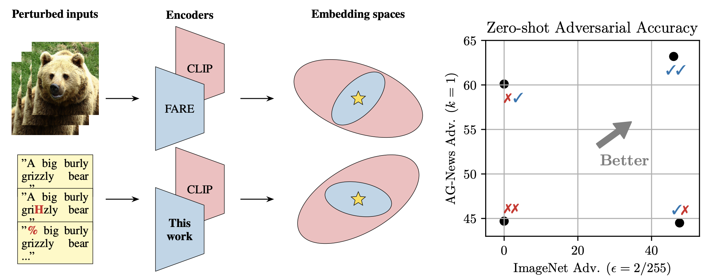

# Robustness in Both Domains: CLIP Needs a Robust Text Encoder

<span style="color:rgb(255, 0, 0);">Elias Abad Rocamora</span>,  <span style="color:rgb(133 203 210);">Christian Schlarmann</span>, <span style="color:rgb(133 203 210);">Naman Deep Singh</span>, <span style="color:rgb(255, 0, 0);">Yongtao Wu</span>, <span style="color:rgb(133 203 210);">Matthias Hein</span> and <span style="color:rgb(255, 0, 0);">Volkan Cevher</span>

<span style="color:rgb(255, 0, 0);">LIONS @ EPFL</span> and <span style="color:rgb(133 203 210);">Tübingen AI Center</span>


[[Paper]](TODO) [[HuggingFace]](https://huggingface.co/LEAF-CLIP) [[BibTeX]](#citation) 

We propose _Levenshtein Efficient Adversarial Finetuning_ (LEAF) in order to obtain an adversarially robust text encoder for CLIP. Combining it with an existing robust image encoder, [FARE](https://github.com/chs20/RobustVLM), yields robustness in both input domains.
All of our models are available on Huggingface 🤗 at [https://huggingface.co/LEAF-CLIP](https://huggingface.co/LEAF-CLIP).

## Table of Contents
- [Installation](#installation)
- [Pretrained Models](#pretrained-models)
- [Training](#training)
- [Evaluation](#evaluation)
- [Citation](#citation)

## Installation
To install the required packages, install Python 3.11 and run:
```bash
pip install -r requirements.txt
export PYTHONPATH="$PYTHONPATH:./src"
```

## Pretrained Models
### Loading CLIPModels

You can load our models as any other CLIP model, for example, loading `LEAF-CLIP/CLIP-ViT-L-rho50-k1-constrained-FARE2` can be done by following the "openai/clip-vit-large-patch14" example snippet:

```python

from PIL import Image
import requests

from transformers import CLIPProcessor, CLIPModel

model_name = "LEAF-CLIP/CLIP-ViT-L-rho50-k1-constrained-FARE2"
processor_name = "openai/clip-vit-large-patch14"

model = CLIPModel.from_pretrained(model_name)
processor = CLIPProcessor.from_pretrained(processor_name)

url = "http://images.cocodataset.org/val2017/000000039769.jpg"
image = Image.open(requests.get(url, stream=True).raw)

inputs = processor(text=["a photo of a cat", "a photo of a dog"], images=image, return_tensors="pt", padding=True)

outputs = model(**inputs)
logits_per_image = outputs.logits_per_image # this is the image-text similarity score
probs = logits_per_image.softmax(dim=1) # we can take the softmax to get the label probabilities


```

When loading other model sizes, the `processor_name` needs to be changed accordingly as:
| Model Size | Processor Name |
|     -      |       -        |
| ViT-L-14   |`"openai/clip-vit-large-patch14"`|
| ViT-H-14   |`"laion/CLIP-ViT-H-14-laion2B-s32B-b79K"`|
| ViT-g-14   |`"laion/CLIP-ViT-g-14-laion2B-s12B-b42K"`|
| ViT-bigG-14   |`"laion/CLIP-ViT-bigG-14-laion2B-39B-b160k"`|

### Loading CLIPTextModels

If just need the text encoder, you can load it with the following snippet:

```python
from transformers import CLIPTokenizer, CLIPTextModel

model_name = "LEAF-CLIP/CLIP-ViT-L-rho50-k1-constrained-FARE2"
processor_name = "openai/clip-vit-large-patch14"

model = CLIPTextModel.from_pretrained(model_name)
tokenizer = CLIPTokenizer.from_pretrained(processor_name)

inputs = tokenizer(["a photo of a cat", "a photo of a dog"],  padding=True, return_tensors="pt")

outputs = model(**inputs)
last_hidden_state = outputs.last_hidden_state
pooled_output = outputs.pooled_output # pooled (EOS token) states
```

## Training

### LEAF (robust rext encoder)

Our models are trained on the first 80k samples from DataComp-small. For instructions on downloading the dataset, follow the [DataComp repository](https://github.com/mlfoundations/datacomp). In order to replicate our training runs, modify the corresponding file in the `scripts` folder to include the data location. For example, ViT-L can be finetuned from the FARE2 checkpoints as:

```bash
bash scripts/train_leaf_vitl.sh
```
If memory requirements are a bottleneck, the parameters `--accum-freq` and `--batch-size` can be adjusted so that they factorize the original batch size of 128. For example, setting `--accum-freq 4` and `--batch-size 32` will perform 4 gradient accumulation steps with a batch size of 32 samples in order to simulate a batch size of 128.

### FARE (robust image encoder)
We adopt the training code from [FARE](https://github.com/chs20/RobustVLM) and show the training commands in `scripts/`. 
We train the models in OpenCLIP format and convert them afterwards to HuggingFace format via `conversion/convert_2.py`.


## Evaluation

### TextFARE loss

To measure the LEAF loss in the AG-News dataset, run:

```bash
python3 eval_textfare.py --model_name LEAF-CLIP/OpenCLIP-ViT-H-rho50-k1-constrained-FARE2
```

### Zero-shot text classification

To evaluate the zero-shot adversarial accuracy in the AG-News dataset, run:

```bash
python3 eval_zero_shot_text.py --model_name LEAF-CLIP/OpenCLIP-ViT-H-rho50-k1-constrained-FARE2
```
Other datasets can be considered by changing the `--dataset parameter`.

### Text-to-image generation

To evaluate the text-to-image generation performance of StableDiffusion v1.5 in the MS-COCO dataset at Levenshtein distance $k=2$ with LEAF, change the `--coco_root` variable to the location of your MS-COCO dataset and run:

```bash
python3 eval_text_to_image.py --model_name stable-diffusion-v1-5/stable-diffusion-v1-5 --batch_size 10 --adv --constrain --k 2 --text_encoder_name LEAF-CLIP/CLIP-ViT-L-rho50-k1-constrained-FARE2 --coco_root path/to/coco/root
```
In order to compute the CLIPScores, modify `--coco_real`, `--coco_captions` and `--path_fake` and run:

```bash
python3 compute_clipscores.py --coco_real path/to/coco/images --coco_captions path/to/coco/captions.json --path_fake path/to/generated_images
```

### Text embedding inversion
To run the text embedding inversions, convert the HuggingFace models to OpenCLIP via `conversion/convert_to_openclip.py`. Then supply checkpoint paths in `src/pez/run_coco.py`and run:
```bash
cd ./src/pez
pip install -r requirements.txt  # install additional requirements
python3 run_coco.py --model vit-h-14 [--robust]
```

### ImageNet evaluation
To evaluate the clean and robust performance on ImageNet, modify `--imagenet_root` and run:
```bash
python3 src/robust_vlm/eval/eval_imagenet.py --model_name LEAF-CLIP/OpenCLIP-ViT-H-rho50-k1-constrained-FARE2 --norm linf --eps 2 --imagenet_root path/to/imagenet
```

### COCO-Retrieval evaluation
To evaluate the clean and robust performance on COCO-retrieval (automatically downloads the LEAF robust models from HF), we use 1000 samples from the `karpathy_test2017` set.
```bash
python eval_retrieval.py --num-samples 1000 --model-name 'ViT-L-14' --coco_root path/to/coco/val2017
```


## Acknowledgement
This codebase gratefully forks from 
- [OpenCLIP](https://github.com/mlfoundations/open_clip)
- [RobustVLM](https://github.com/chs20/RobustVLM)
- [hard-prompts-made-easy](https://github.com/YuxinWenRick/hard-prompts-made-easy)
- [CLIP_benchmark](https://github.com/LAION-AI/CLIP_benchmark)

## Citation
If you find this project useful, please cite our paper:
```bibtex
```
